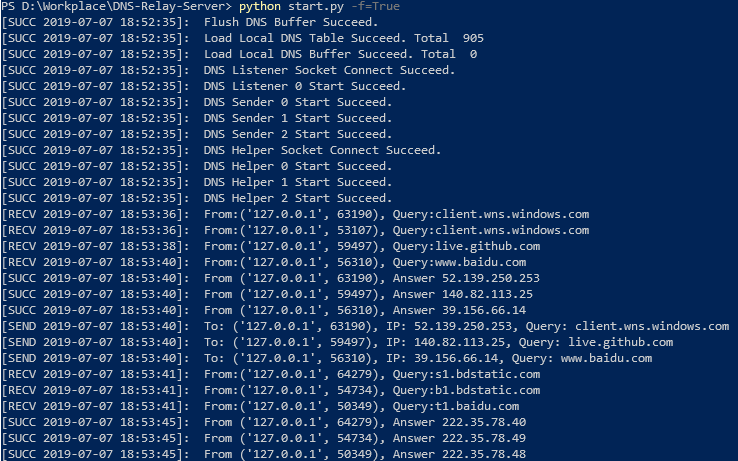

# DNS-Relay-Server
Computer Network Practice: DNS Relay Server


# Usage

- Clone the code

   ```shell
  git clone https://github.com/HelloSilicat/DNS-Relay-Server.git
  cd DNS-Relay-Server
  ```

- Run the server

  ```shell
  python start.py
  ```

- [Optional] You could change the running configuration, like:

  ```shell
  python start.py -b=True -r=x.x.x.x -t="./dnsrelay.txt" 
  
  # -b: Output the log, default=False
  # -t: Local DNS Query Table File, default="./dnsrelay.txt"
  # -r: Remote Queried DNS Server IP, default="10.3.9.5"
  ```


## Running Show



